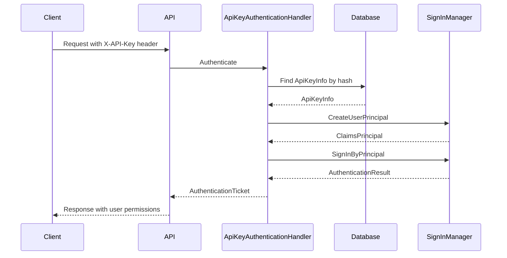

# Cundi.XAF.ApiKey.Api

ASP.NET Core Web API authentication module for API Key support in XAF applications.

## Features

- **X-API-Key Header Authentication**: Standard API Key authentication via HTTP header
- **XAF Security Integration**: Full integration with XAF's permission system via `SignInManager`
- **Swagger Support**: API Key authorization in Swagger UI
- **Multi-Scheme Auth**: Works alongside JWT authentication

## Installation

### 1. Add Project Reference

Add a reference to `Cundi.XAF.ApiKey.Api` in your Web API project.

### 2. Add Module

```csharp
// In Startup.cs ConfigureServices
builder.Modules.Add<Cundi.XAF.ApiKey.Api.ApiKeyApiModule>();
```

### 3. Configure Authentication

```csharp
using Cundi.XAF.ApiKey.Api.Extensions;

services.AddAuthentication()
    .AddJwtBearer(...)   // Keep existing JWT auth
    .AddApiKey();        // Add API Key auth
```

### 4. Update Authorization Policy

To support both JWT and API Key authentication:

```csharp
services.AddAuthorization(options =>
{
    options.DefaultPolicy = new AuthorizationPolicyBuilder(
        JwtBearerDefaults.AuthenticationScheme,
        "ApiKey")
            .RequireAuthenticatedUser()
            .RequireXafAuthentication()
            .Build();
});
```

### 5. Add Swagger Support (Optional)

```csharp
services.AddSwaggerGen(c =>
{
    c.AddSecurityDefinition("ApiKey", new OpenApiSecurityScheme()
    {
        Type = SecuritySchemeType.ApiKey,
        Name = "X-API-Key",
        In = ParameterLocation.Header,
        Description = "API Key authentication"
    });
    c.AddSecurityRequirement(new OpenApiSecurityRequirement() {
        {
            new OpenApiSecurityScheme() {
                Reference = new OpenApiReference() {
                    Type = ReferenceType.SecurityScheme,
                    Id = "ApiKey"
                }
            },
            new string[0]
        }
    });
});
```

## Usage

Include the `X-API-Key` header in your HTTP requests:

```bash
curl -H "X-API-Key: cak_your-api-key-here" \
     https://localhost:5001/api/odata/YourEntity
```

## Authentication Flow



## Project Structure

```
Cundi.XAF.ApiKey.Api/
├── Authentication/
│   └── ApiKeyAuthenticationHandler.cs  # ASP.NET Core auth handler
├── Extensions/
│   └── ApiKeyExtensions.cs             # AddApiKey() extension
└── ApiKeyApiModule.cs
```

## License

MIT License
