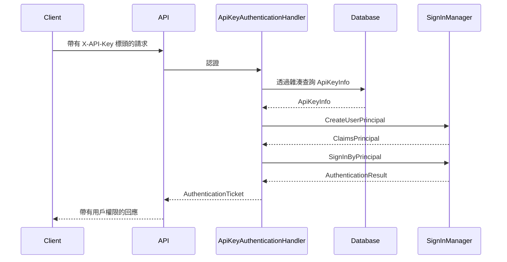

# Cundi.XAF.ApiKey.Api

為 XAF 應用程式提供 API Key 認證支援的 ASP.NET Core Web API 模組。

## 功能特色

- **X-API-Key Header 認證**：透過 HTTP 標頭進行標準 API Key 認證
- **XAF 安全整合**：透過 `SignInManager` 完整整合 XAF 權限系統
- **API Key 管理端點**：提供 RESTful API 端點來產生、查詢和移除 API Key（僅限管理員）
- **Swagger 支援**：在 Swagger UI 中支援 API Key 授權
- **多重認證方案**：可與 JWT 認證並行使用

## 安裝方式

### 1. 加入專案參考

在您的 Web API 專案中加入 `Cundi.XAF.ApiKey.Api` 參考。

### 2. 加入模組

```csharp
// 在 Startup.cs ConfigureServices 中
builder.Modules.Add<Cundi.XAF.ApiKey.Api.ApiKeyApiModule>();
```

### 3. 設定認證

```csharp
using Cundi.XAF.ApiKey.Api.Extensions;

services.AddAuthentication()
    .AddJwtBearer(...)   // 保留現有 JWT 認證
    .AddApiKey();        // 加入 API Key 認證
```

### 4. 更新授權策略

同時支援 JWT 和 API Key 認證：

```csharp
services.AddAuthorization(options =>
{
    options.DefaultPolicy = new AuthorizationPolicyBuilder(
        JwtBearerDefaults.AuthenticationScheme,
        "ApiKey")
            .RequireAuthenticatedUser()
            .RequireXafAuthentication()
            .Build();
});
```

### 5. 加入 Swagger 支援（選用）

```csharp
services.AddSwaggerGen(c =>
{
    c.AddSecurityDefinition("ApiKey", new OpenApiSecurityScheme()
    {
        Type = SecuritySchemeType.ApiKey,
        Name = "X-API-Key",
        In = ParameterLocation.Header,
        Description = "API Key 認證"
    });
    c.AddSecurityRequirement(new OpenApiSecurityRequirement() {
        {
            new OpenApiSecurityScheme() {
                Reference = new OpenApiReference() {
                    Type = ReferenceType.SecurityScheme,
                    Id = "ApiKey"
                }
            },
            new string[0]
        }
    });
});
```

## 使用方式

在 HTTP 請求中加入 `X-API-Key` 標頭：

```bash
curl -H "X-API-Key: cak_your-api-key-here" \
     https://localhost:5001/api/odata/YourEntity
```

## 認證流程



## 專案結構

```
Cundi.XAF.ApiKey.Api/
├── Authentication/
│   └── ApiKeyAuthenticationHandler.cs  # ASP.NET Core 認證處理器
├── Controllers/
│   └── ApiKeyController.cs             # API Key 管理端點
├── DTOs/
│   ├── ApiKeyInfoDto.cs                # API Key 資訊回應
│   ├── GenerateApiKeyRequest.cs        # 產生請求
│   └── GenerateApiKeyResponse.cs       # 產生回應
├── Extensions/
│   └── ApiKeyExtensions.cs             # AddApiKey() 擴充方法
└── ApiKeyApiModule.cs
```

## API Key 管理端點

> **注意：** 這些端點需要管理員權限。

### 產生 API Key

```http
POST /api/ApiKey/generate
Content-Type: application/json

{
  "userOid": "00000000-0000-0000-0000-000000000000",
  "expiration": "Days30",
  "description": "我的 API Key"
}
```

**過期選項：** `Minutes5`、`Minutes30`、`Day1`、`Days30`、`Days60`、`Days90`

**回應：**
```json
{
  "success": true,
  "apiKey": "cak_...",
  "expiresAt": "2025-01-20T00:00:00Z",
  "message": "API Key 產生成功..."
}
```

### 查詢 API Key 資訊

```http
GET /api/ApiKey/{userOid}
```

**回應：**
```json
{
  "userOid": "00000000-0000-0000-0000-000000000000",
  "description": "我的 API Key",
  "createdAt": "2024-12-20T00:00:00Z",
  "expiresAt": "2025-01-20T00:00:00Z",
  "lastUsedAt": null,
  "isActive": true,
  "isExpired": false,
  "isValid": true
}
```

### 移除 API Key

```http
DELETE /api/ApiKey/{userOid}
```

**回應：**
```json
{
  "success": true,
  "message": "已移除使用者 Oid '...' 的 API Key。"
}
```

## 授權

MIT License
